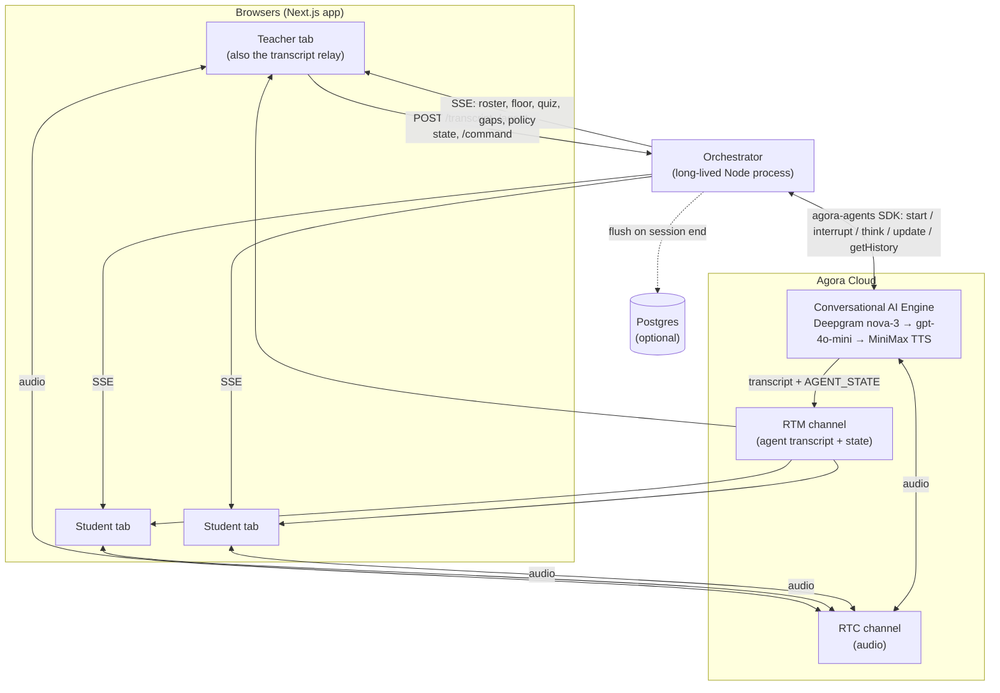
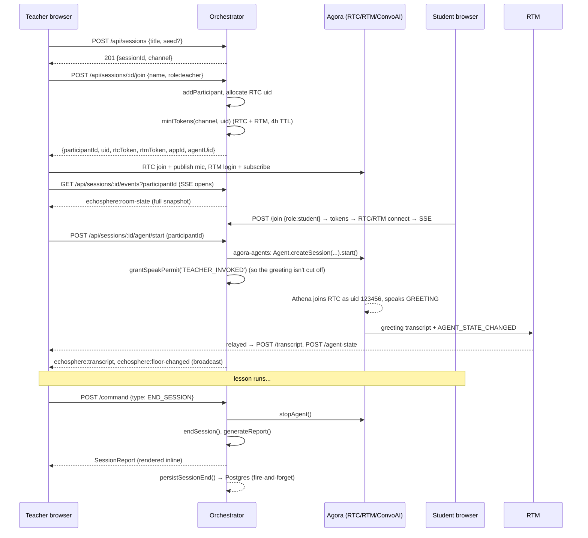
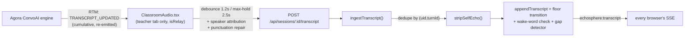
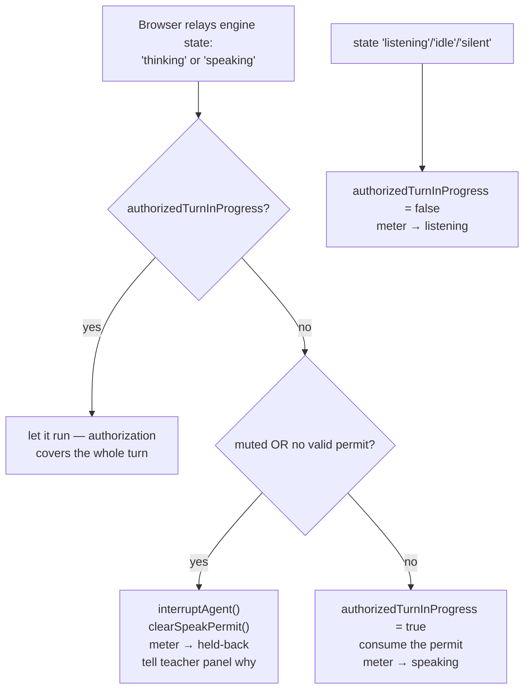
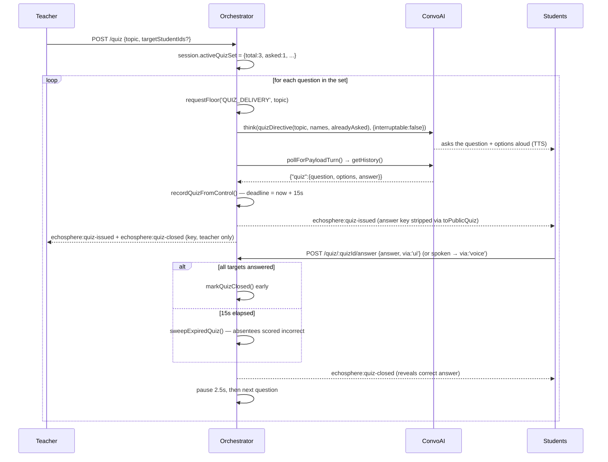

# System Design — Athena, the Voice AI Co-Teacher

A live, audio-only classroom where a **teacher**, several **students**, and an AI
co-teacher named **Athena** share one Agora voice channel. Athena hears the whole
lesson, speaks only when invited, runs spoken quizzes, tracks who is struggling,
and hands the teacher a post-class summary — while the teacher keeps a hard mute
and override at all times.

Built for PS31 against
[`docs/PS31-ai-co-teacher-implementation-plan.md`](PS31-ai-co-teacher-implementation-plan.md).
This document is the architecture reference; [`README.md`](../README.md) is the
setup guide and [`docs/BUILD-LOG.md`](BUILD-LOG.md) is the bug-by-bug history.

---

## 1. The one idea to hold onto: two channels

Everything in this system is one of two flows.

| | **Audio path** | **Control path** |
|---|---|---|
| Carries | speech, Athena's TTS, Athena's ASR transcript, her engine state | roster, floor state, quiz cards, gaps, policy, teacher commands |
| Transport | Agora **RTC** (audio) + Agora **RTM** (agent transcript/state), both driven by Agora's Conversational AI engine | **SSE** orchestrator→browser (`GET /events`) + plain **HTTP POST** browser→orchestrator |
| Who owns it | Agora's cloud | the orchestrator process |
| Runs without the other? | yes — RTM failing degrades the room to "silent classroom", not "dead page" | yes — audio keeps working if the orchestrator is down |

The plan assumed RTM would carry the control events too. **It can't:** Agora's RTM
SDK is browser-only, with no server variant, so the orchestrator cannot publish
to the channel. The control path is a separate SSE/HTTP layer the orchestrator
runs itself. RTM is still used — but only for what it is uniquely good at:
relaying Athena's own transcript and state from Agora's engine to the browser.



---

## 2. Topology

```
apps/web           Next.js 16 / React 19 frontend — join screen, teacher
                   dashboard, student view. Owns all browser-side Agora
                   (RTC hooks, RTM client, the ConvoAI client toolkit).

apps/orchestrator  Long-lived Fastify (Node 22, tsx) service — "the brain":
                   session registry, floor state machine, speak-permit
                   enforcement, lesson store, quiz engine, gap detector,
                   post-class report, optional Postgres flush.

packages/shared-types  Domain types + a few pure helpers, imported by both.
```

pnpm workspace. The web app is an extension of Agora's official
`agent-quickstart-nextjs`; the original 1:1 quickstart routes
(`app/api/invite-agent`, etc.) are still present as a reference baseline but are
not wired to any classroom page.

### Why the orchestrator is one long-lived process (not serverless)

1. **The floor state machine needs a single authoritative writer per classroom.**
   Two replicas would race on "may Athena speak right now".
2. **The `agora-agents` `AgentSession` object must stay in memory.** `interrupt()`,
   `think()`, `update()`, `getHistory()` are all called against that live handle.

A second replica would need sticky routing by `sessionId`. State is in-process
and flushed to Postgres once, at session end.

### No API keys beyond Agora

Speech recognition, the language model, and the voice are **all resold through
the one Agora project** — Deepgram nova-3, `gpt-4o-mini`, and MiniMax
`speech_2_6_turbo`, behind a single ConvoAI agent running in *App Credentials*
mode. `apps/orchestrator/.env` and `apps/web/.env.local` contain only
`NEXT_PUBLIC_AGORA_APP_ID` and `NEXT_AGORA_APP_CERTIFICATE`. Nothing calls OpenAI
or any other vendor directly. (Two optional exceptions, both no-ops when unset:
`OPENAI_API_KEY`/`SARVAM_API_KEY` for the post-class narrative paraphrase, and a
Sarvam STT/TTS path in the agent config.)

---

## 3. Session lifecycle



Key ordering rule from the plan (§3.2): **identity and role are resolved before an
Agora token is minted.** `mintTokens` is only ever called from inside the join
route, after `addParticipant` has recorded the role — an RTC uid can never exist
in a channel without a known role behind it.

- **Agent RTC uid** is the fixed constant `123456` (`AGENT_UID`), matched on both
  sides, so any client can tell Athena's audio/transcript from a human's.
- **Human RTC uids** are random positive integers from a disjoint range.
- **Channel name** is `echosphere-<sessionId>` — derivable from either.
- Tokens are a combined **RTC + RTM** mint (`agora-token`): RTC for audio, RTM to
  receive Athena's transcript stream.

---

## 4. The transcript pipeline

Athena's ASR output and every human utterance reach the orchestrator through
**the teacher's browser acting as a relay**. This is forced by Agora's
architecture, not a choice: RTM is browser-only, so a browser is the only place
the agent's transcript can be observed, and the teacher's tab is the one client
guaranteed present for the whole lesson.



What the relay has to solve:

- **Turns are cumulative buffers, not finished sentences.** The toolkit re-emits
  the same `turn_id` with a few more words each time, every snapshot marked
  "settled". The relay holds a turn until its text stops changing for
  `TURN_SETTLE_MS` (1.2s), then sends it. Continuous speech that never pauses is
  force-published on a `TURN_MAX_HOLD_MS` (2.5s) ceiling and the server updates
  the same row in place.
- **Human turns carry no speaker identity** — the toolkit reports every one as
  uid `"0"`. Attribution comes from a **150 ms `getVolumeLevel()` poll** across
  all remote tracks plus the local mic; the loudest candidate wins and is fixed
  at first sight of the turn (never revised, or a sentence changes owner as it
  grows). A runner-up is tracked and an `attributionConfidence` of
  `best / (best + second)` is attached — a close call reaches the transcript
  marked uncertain rather than stated as fact. (Agora's own `volume-indicator`
  event is fixed at a 2 s interval, too coarse for a fast teacher→student
  handoff, so it is deliberately not used.)
- **De-duplication.** Every browser sees the same RTM stream and any could relay;
  `(uid, turnId)` identifies one utterance. A grown re-emit of a stored turn
  replaces it in place; identical text is dropped; a text-only repeat outside a
  4 s window is treated as a real "asked twice", not an artifact.
- **Self-echo.** In the common setup (one room, laptop speakers, no headphones)
  Athena's TTS is picked up by open mics and transcribed as if a human said it.
  `stripSelfEcho` subtracts any span matching something Athena said in the last
  10 s (exact, substring, or trigram-fuzzy) and returns the **remainder**, so a
  student answering over the tail of her sentence isn't thrown away with the echo.
- **Injected instructions are filtered.** Text `think()`-ed into the pipeline
  comes back through the transcript as though a human said it; anything starting
  with `[classroom:system]` is dropped before logging or analysis.

Anyone joining mid-lesson backfills history once via `GET /transcript`; live
segments arrive over SSE and the `segmentId` de-dupe absorbs the overlap.

---

## 5. Turn-taking — the core safety property

The plan's non-negotiable: **no code path can let Athena speak while muted.** This
is structural, not a prompt instruction.

### Two layers, not redundant

| Layer | What it does | Binding? |
|---|---|---|
| **System prompt** (`prompt.ts`) | Shapes *what* Athena says once she's allowed to; tells her silence is the default | advisory |
| **Floor state machine + speak permit** (`floorMachine.ts`, `classroomController.ts`) | Decides *whether* a turn is allowed at all, and cuts off any turn that began without permission | binding |

### `decideSpeak` — the only permission-granter

`decideSpeak(floor, policy, trigger, inputs)` in
[`floorMachine.ts`](../apps/orchestrator/src/floor/floorMachine.ts) is a **pure
function** and the only place a "may speak" answer is produced. It returns a
discriminated union (`{allowed: true, trigger}` | `{allowed: false, reason}`), not
a boolean, so a denial can't be coerced to yes. Precedence, in order:

1. `policy.muted` → **`AGENT_MUTED`** (checked before everything, including
   teacher-invoked speech)
2. `TEACHER_INVOKED` / `QUIZ_DELIVERY` → allowed unless the topic is disabled
3. `TEACHER_HOLDS_FLOOR` → denied
4. `AGENT_SPEAKING` → denied (never stack on ourselves)
5. topic disabled → denied
6. `DIRECTLY_ADDRESSED` → allowed **only if `policy.studentsMayInvoke`**
7. `GAP_DETECTED_IN_SILENCE` → allowed only if proactive mode is on **and** there
   is an unaddressed class-wide gap **and** the silence exceeds the threshold

Its single caller is `requestFloor` in `classroomController.ts` — **one door** for
every path that can make Athena talk. Denials are broadcast to the teacher panel
(`echosphere:agent-blocked`) so a blocked attempt is visible during a demo.

### The speak permit — because ConvoAI never asks first

Agora's Conversational AI engine answers every user turn **on its own
initiative**. It never consults the orchestrator. So `requestFloor` governs only
speech the *orchestrator* starts; Athena's ordinary "someone said my name"
replies would bypass §3.3 entirely.

The fix is a **permit + after-the-fact enforcement**:

- When someone addresses Athena (or the teacher invokes her), a
  `speakPermit { grantedAt, reason }` is granted, TTL **15 s** — this only bounds
  the gap between being addressed and the engine's first thinking/speaking
  transition, not how long she may then talk.
- The browser relays `AGENT_STATE_CHANGED`. `handleAgentState` is the enforcement
  point:



- Once a turn is authorized, `authorizedTurnInProgress` covers it to completion.
  Only an **explicit** revocation ends it early — `MUTE_AGENT`, `onTeacherBargeIn`,
  or closing the floor to students — and each of those calls `interruptAgent()`
  *directly* rather than waiting for the next state poll. (Re-validating the
  15 s TTL against every mid-turn event was cutting real, long answers off
  mid-sentence; this flag fixed that.)
- The permit is **not** cleared when a turn's transcript arrives — that transcript
  lands after the *next* turn may already have been authorized, and clearing then
  revoked a reply that had only just been granted.

### Floor states

`OPEN_FLOOR` (nobody, or a student addressing the class) · `TEACHER_HOLDS_FLOOR`
(teacher speaking — Athena silent unless directly addressed) · `AGENT_SPEAKING` ·
`STUDENT_QUESTION_PENDING` (someone addressed Athena, awaiting reply). Transitions
are pure functions of `(snapshot, role, now)`. A **teacher barge-in** transitions
to `TEACHER_HOLDS_FLOOR` and returns `mustInterruptAgent` in the same value, so
the transition and the side effect can't drift apart.

### Wake-word matching

Deepgram renders "Athena" as "Xena", "Tina", "Athina", "Serena"… depending on
accent and mic. `isAddressedToAgent` accepts a list of known mis-hearings —
the occasional false wake is a far cheaper failure than an agent that can't be
called. The configured `wakePhrase` always wins, so a teacher can rename her.

### The teacher-address special case

The engine has **no speaker identity** — it can't tell the teacher from a student.
So with the floor closed to students, it stays silent even for the teacher. When
the orchestrator sees the *teacher* address Athena by name (it knows who spoke),
it drives the reply explicitly with a `[classroom:system]` `think()` directive.
Skipped when the floor is open, where the autonomous reply already works.

---

## 6. The control channel — structured data with no second model

Athena appends **one JSON object per spoken turn**:

```json
{"to":"Ana","gap":{"topic":"common denominator","students":["Ana","Bilal"]},
 "quiz":{"topic":"...","question":"...","options":["A","B","C","D"],"answer":"B"}}
```

MiniMax **`skipPatterns: [5]`** strips curly-brace content before speech
synthesis, so the object never reaches the room's ears. No classifier, no second
API call — structured output rides the existing voice pipeline. The reader
(`control.ts`) walks back from the last `}` and lets `JSON.parse` decide which
`{` opens the payload (tracking quote parity fails — spoken prose has stray
apostrophes).

**The catch:** `skipPatterns` also strips the braces from the RTM transcript the
browser relays. So for quiz payloads the orchestrator can't read the control
object off the relay at all — it polls **`agentSession.getHistory()`** (the raw
LLM output, braces intact) via `pollForPayloadTurn`, which waits for a *new*
assistant turn containing a *balanced* `{ … }` (a half-streamed payload has no
closing brace yet). `{to}` / `{gap}` on ordinary turns still come off the relay
and are therefore best-effort.

---

## 7. Quizzes

One **"Start Quiz"** asks a **set of 3 questions** on a topic, auto-advancing.



- **Question and card can't drift** — both come from the *same* generation. The
  directive tells Athena to speak the question, then append it word-for-word on
  the control channel.
- Every question in the set requests the floor independently (Q2/Q3 were silently
  going out without a permit and enforcement killed the turn before the payload).
- `not interruptable` — a stray "okay" truncating the turn before its trailing
  `{quiz}` leaves nothing to score.
- **Answers** normalise from a UI tap (option text), a spoken letter/number, or a
  sentence ("I think it's B", "option two"). Voice answers only count if they
  resolve to an actual option.
- A **fresh Start Quiz**, a **mute**, or **End Lesson** cancels a running set.

---

## 8. Learning gaps & proactive interjection (§3.9, §3.3b)

Two independent signals feed one set of clusters:

1. **Wrong quiz answers**, tagged with the quiz's topic.
2. **Confused questions** from the transcript, matched by conservative regex
   (`"I don't get"`, `"doesn't make sense"`, …). A false positive here makes
   Athena interject over a clear lesson, so the patterns are deliberately narrow.
3. (also) **Gaps Athena reports herself** on the `{gap}` control channel — she
   hears tone the regexes can't.

Clustering is simple and explainable: a signal joins a gap when the topic matches
or its text Jaccard-overlaps existing evidence above 0.34. A gap becomes
**class-wide** (worth interrupting for) at **2+ distinct students**. One confused
student is better served by a direct answer than by stopping the class.

**Proactive interjection** is the *only* unprompted speech. A `setInterval` tick
in `server.ts` (1 s) calls `considerSilenceInterjection`, which fires **only if**
all of: proactive mode on **and** an unaddressed class-wide gap exists **and**
silence exceeds `silenceGapThresholdMs` (3.5 s default). Then it marks the gap
addressed and `think()`s a brief acknowledge-and-clarify directive.

Gap data is **teacher-only** — `publishToTeachers` gates it at the fan-out point,
so students never see who is struggling.

---

## 9. Lesson grounding (§3.4)

The teacher pastes slides/notes → `LessonStore.addDocument` chunks it
(~700 chars, paragraph-first, with overlap) and builds a **hashed embedding** per
chunk: character trigrams of content words, hashed into a fixed 256-dim vector,
TF-weighted, L2-normalised, compared by cosine similarity. This is a real (if
simple) in-memory vector index — there's no embeddings API to call, and it's
honest about what it catches ("denominators" ≈ "denominator") without
overclaiming synonym matching.

**Everything Athena knows lives in her system prompt.** With no custom LLM
endpoint, `buildClassroomInstructions` composes the whole classroom — persona,
lesson title, per-student roster with proficiency, teacher policy, lesson
material — and `pushInstructions` re-pushes it with `agentSession.update()`
whenever any of it changes (a student joins, a level is retagged, material is
uploaded, verbosity/topic policy moves). Small material goes in whole; a large
document contributes the chunks most relevant to recent conversation.

> `update()` overwrites `params` wholesale, so **`model` must be repeated every
> time** — omitting it wiped the model from a running agent the moment a second
> person joined, and every turn came back as the failure message.

Inspect the live prompt any time: `GET /api/sessions/:id/prompt`. Inspect what
the model actually produced (vs. what survived TTS): `GET /agent/history`.

---

## 10. Per-student explanation depth (§3.5)

Each student carries a `proficiency` tag (`beginner` / `intermediate` /
`advanced`). It reaches Athena purely through the roster block of the prompt —
she matches the depth listed for whoever she's answering, no per-turn injection
needed. The tag moves two ways:

- **Teacher** sets it from the roster panel (`SET_PROFICIENCY`).
- **Quiz performance** re-derives it: after ≥3 answers, accuracy ≥0.85 →
  advanced, ≥0.55 → intermediate, else beginner. An inferred change re-pushes the
  prompt just like a manual one.

---

## 11. Post-class report (§3.9)

`generateReport` is **deterministic** — misconceptions, per-student stats, concept
mastery, follow-ups are all derived from what the gap detector and quiz engine
logged as it happened. A model would only be paraphrasing them, and unlike a
generated narrative these can't be wrong. The teacher is excluded from the
per-student roster (and so is a second tab a teacher opened under the same name).

The **one** place a model earns its keep is the narrative paragraph:
`generateNarrative` tries a real completion via `llm/complete.ts` (if
`OPENAI_API_KEY` / `SARVAM_API_KEY` is set) and falls back verbatim to a
deterministic template otherwise. Never throws.

Rendered inline on the teacher dashboard when the lesson ends: stat tiles (key
concept grasp, questions to Athena, topics covered), learning-gap list,
per-student table, concept-mastery bars, and an intervention timeline.

---

## 12. Persistence (§4) — optional

In-memory `ClassroomSession` is the source of truth for a live session. It is
flushed to Postgres **once**, at session end (`persistSessionEnd`), via Drizzle.
No `DATABASE_URL` → a logged no-op, same graceful-degradation posture as every
other integration. The write is fire-and-forget (a DB hiccup must not block the
teacher's "end lesson") and idempotent (every row keys off an id already stable
in memory). Normalised tables for participants / transcript / quizzes / answers /
gaps; the generated `SessionReport` is stored whole as one JSONB blob.

---

## 13. State ownership

| State | Owner | Notes |
|---|---|---|
| Roster, roles, RTC uid ↔ participantId | orchestrator (`sessionRegistry`) | in-memory `Map` per session |
| Floor snapshot, agent policy, speak permit | orchestrator | single writer; the whole reason it's one process |
| Rolling transcript (full log) | orchestrator | last 40 segments form the LLM context window |
| Quizzes, answers, gaps | orchestrator | |
| Lesson material + embeddings | orchestrator (`LessonStore`) | |
| Live audio + Athena's ASR/state | Agora cloud | orchestrator observes via the browser relay |
| Athena's system prompt | orchestrator composes → Agora holds | re-pushed on every state change |
| Browser view (roster, floor, quizzes…) | mirror only | `useClassroom` applies SSE events, never derives locally |

The browser **never** computes floor/policy/quiz state itself — it only applies
what the orchestrator sends. That's why the teacher's mute and the students' view
can't disagree.

---

## 14. Failure modes & mitigations

| Symptom | Cause | Mitigation |
|---|---|---|
| `Ins id is 2` / `Offset is outside the bounds of the DataView` in console | `next dev` Fast Refresh re-evaluates modules, desyncing the RTM client | Run `next build && next start` for any demo; `ClassroomShell` also ref-counts one RTM client per (app,uid,channel) with a 3 s teardown grace |
| Student's question logged twice under two names | Two browsers each guessing a speaker for the same uid-`"0"` turn | Exactly one relay, and it must be the teacher's tab (`isRelay`) |
| Black boxes on the student view | `<RemoteUser>` renders a video-player div | Audio-only: `useRemoteAudioTracks` + `<RemoteAudioTrack>` (renders nothing) |
| Athena answers "can everyone hear me?" | Engine treats any room question as hers | Prompt hammers "a question in the room is not a question for you"; enforcement cuts an un-permitted turn |
| Athena keeps talking after a stray "okay" | Engine barge-in (`interrupt_duration_ms`) fires for *any* uid in `remoteUids: ['*']` and can't be speaker-scoped | Both VAD thresholds pinned to Agora's documented max; the orchestrator's own teacher-gated `interruptAgent()` is the real barge-in path |
| Quiz card never appears / "0/0" in report | `skipPatterns` strips `{quiz}` from the relay too | Read the payload from `getHistory()` instead |
| Multilingual (`STT_LANGUAGE=multi`) returns nothing | Deepgram code-switch mode produces no transcription through the resale path | One language at a time via `STT_LANGUAGE`; verify with `test:speech` |
| SSE refused by the browser (CORS) | `reply.raw.writeHead` bypasses `@fastify/cors` | CORS headers set explicitly in the `/events` handler |

---

## 15. File map

**Orchestrator** (`apps/orchestrator/src/`)

| File | Responsibility |
|---|---|
| `server.ts` | Fastify boot, CORS, the 1 s silence tick, graceful shutdown (stops all agents) |
| `config.ts` | env resolution — Agora creds are the only required values |
| `routes/classroom.ts` | the whole classroom HTTP surface + the SSE `/events` handler |
| `routes/tokens.ts` | `mintTokens` — combined RTC+RTM, called only from `/join` |
| `routes/inspect.ts` | `GET /prompt`, `GET /agent/history` — debugging windows |
| `routes/completions.ts` | dormant OpenAI-compatible proxy for the intervention gate |
| `classroomController.ts` | the seam: transcript-in → attribution → floor → gap → speak decision; agent-turn-out → control parse → quiz/gap. Owns `requestFloor`, the permit, quiz delivery |
| `floor/floorMachine.ts` | pure floor state machine + `decideSpeak` + wake-word matching |
| `agent/agentLifecycle.ts` | `agora-agents` wrapper — start/stop/interrupt/think/update, `pollForPayloadTurn` |
| `agent/prompt.ts` | system-prompt composition + every `[classroom:system]` directive |
| `agent/control.ts` | brace-payload reader |
| `agent/echo.ts` | self-echo subtraction |
| `agent/interventionGate.ts` | pure restraint-score function (feature dormant) |
| `quiz/quizEngine.ts` | record / normalise / score / close, proficiency feedback loop |
| `gaps/gapDetector.ts` | clustering, `pendingClassWideGap`, ranked gap list |
| `lesson/lessonStore.ts` | chunking + hashed-embedding retrieval |
| `report/summary.ts` | deterministic report + LLM narrative (with fallback) |
| `report/persist.ts` + `db/` | optional Postgres flush |
| `state/sessionRegistry.ts` | the in-memory `ClassroomSession` and all its accessors |
| `state/eventBus.ts` | SSE fan-out — `publish` / `publishToTeachers` / `publishTo` |

**Web** (`apps/web/`)

| File | Responsibility |
|---|---|
| `app/join/page.tsx` | role + session picker; posts to `/join`, stores identity in `sessionStorage` |
| `app/teacher/[sessionId]/page.tsx` | control panel, lesson upload, gap dashboard, restraint meter, inline report. **This tab is the relay.** |
| `app/classroom/[sessionId]/page.tsx` | student view — transcript, roster, quiz cards + overlay |
| `components/classroom/ClassroomShell.tsx` | RTC provider + one logged-in RTM client (ref-counted) |
| `components/classroom/ClassroomAudio.tsx` | RTC join + mic publish + the transcript relay + volume-poll attribution |
| `components/classroom/QuizOverlay.tsx` | centred student quiz modal with countdown ring |
| `components/classroom/panels.tsx` | roster / transcript / quiz / gap / blocked-attempts panels |
| `components/meraki/RestraintMeter.tsx` | canvas "tuning eye" character driven by `restraintMeterState` |
| `hooks/useClassroom.ts` | the SSE subscription and the local room mirror |
| `lib/orchestrator.ts` | typed client for every orchestrator route |

**Shared** (`packages/shared-types/src/`): `identity.ts` (roles, participants,
stats) · `floor.ts` (floor states, `AgentPolicy`, `TeacherCommand`,
`SpeakDecision`) · `lesson.ts` (transcript, quiz, gap, report) · `events.ts`
(`ClassroomEvent` union, `RoomState`, `toPublicQuiz`).

---

## 16. Verification

```bash
pnpm -r typecheck
pnpm -r lint
pnpm --filter @echosphere/orchestrator test    # ~80 pure-logic checks:
                                               # tokens, control parser, floor
                                               # machine, permit, echo, gate, quiz
pnpm --filter @echosphere/web build
pnpm --filter @echosphere/web test:e2e         # real browser, both servers, fake mic
pnpm --filter @echosphere/web test:roundtrip   # live agent: she speaks, words +
                                               # quiz card come back (spends Agora minutes)
```

`test:roundtrip` is the one that matters: it puts a **student** in the room
(triggering `session.update()`), starts the agent, and asserts her words — and a
quiz card with its countdown — return through the full pipeline. Every serious
bug in this project passed typecheck, lint, and the API tests and only showed up
there.
